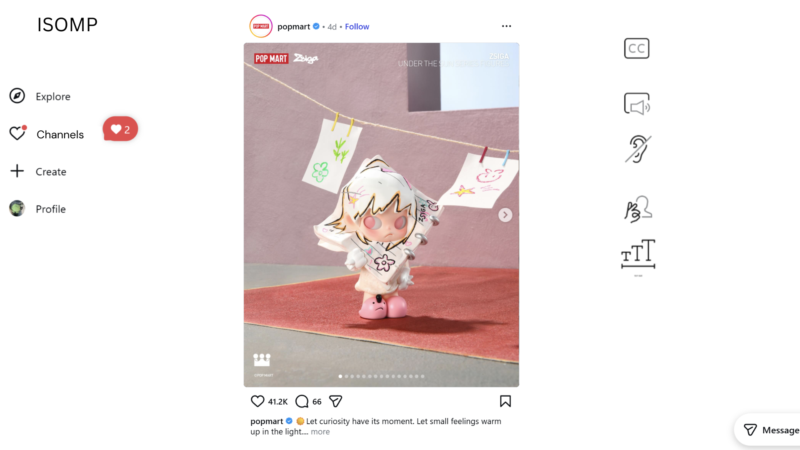
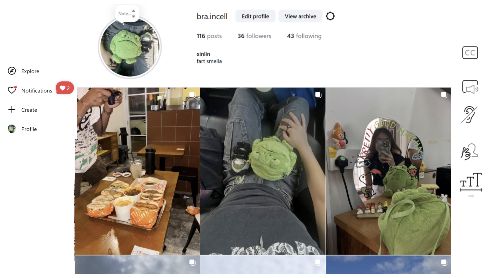
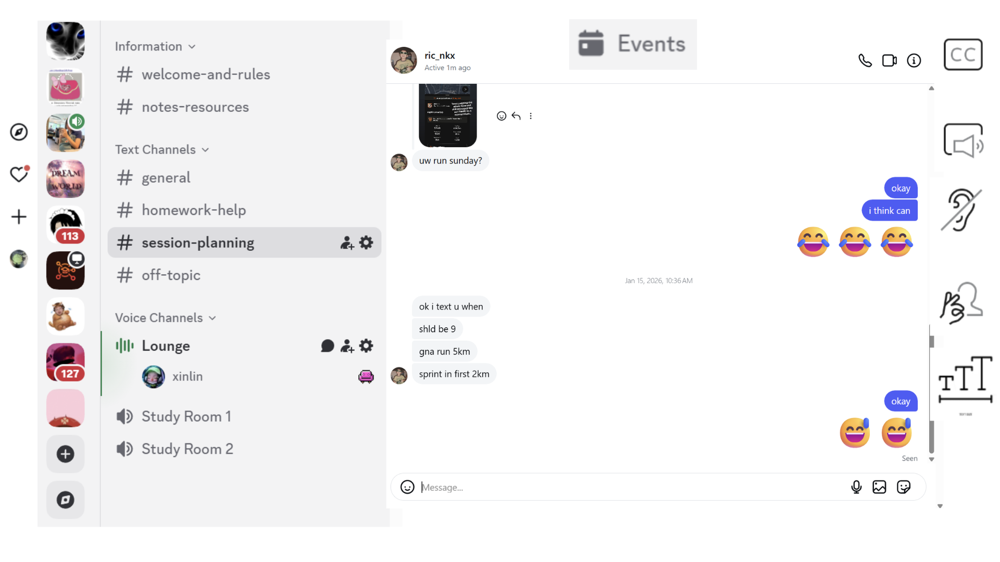
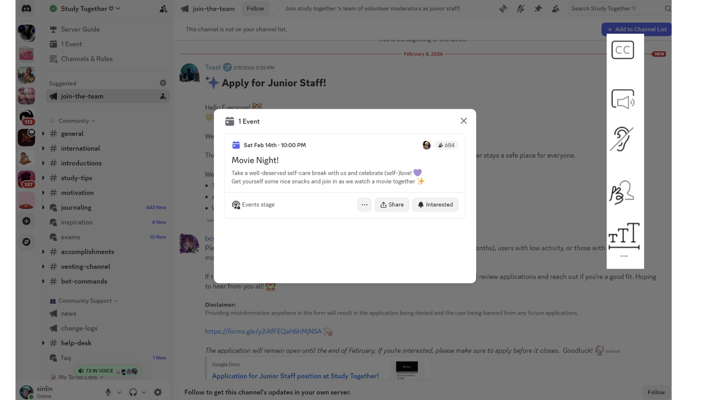

## 6. UI/UX Requirements
### Key Screens/Pages

- [Explore (Main) Page]

  - Purpose: Scroll through other users and channel's posts. There is one column for one post to minimise distractions.
  - Types of posts displayed: text (refer to twitter), videos (refer to tiktok) and pictures (refer to instagram)
  - Components: 
    - For each post: post, caption, image, likes/comments/shares
    - For the page: many post components, scroll through
    - On left side of the page: navigation component
      - Navigation tabs: Profile, explore, channels, create
    - On right side of the page: accessibility component
      - Components: text to speech, speech to text, in-real-time sign language to captions, change text size, video transcribing
  - Interactions: 
    - We want to scroll down this page.
    - We want to like and comment on posts.
    - We want to be able to navigate to other pages using the 'tabs' component.

- [Personal Profile Page]

  - Purpose: Showcase personal posts
  - Components:
    - Profile details component - Profile picture, name, follower details, profile description
    - Posts_Grid - contains a 3x3 grid of post components
    - Accessibility component
  - Interactions: 
    - They can click on a single post and it will display the post on the page.
    - They can customize their profile details.
    - They can create new posts.
    - Left side of page - navigation component.

- [Channels Page]

  - Purpose: Shows list of channels. Each channel is for a specific community, such as the deaf community, the blind community, neurodivergent community.
  - Components: 
    - Channels component
    - Channel component
    - Broadcast component
    - Events component
    - Left side of page - navigation component
  - Interactions: 
    - Users can click on a channel they want to join.
    - Upon clicking on the channel, the right side of the screen shows the broadcast component for that channel.
    - Upon clicking events component, moves to the booking page.

- [Booking System Page]

  - Purpose: allow user to book events for that specific community
  - Components: 
    - EventsList
    - Event component
      - Event details, event image
  - Interactions: 
    - Users can click on 'Interested' button to indicate their availability for the event.
    - Click off the EventsList Component to go back to Channels Component

### Design System
- Colors: [Primary, secondary, accent colors]
- Typography: [Font families, sizes]
- Components: [Reusable UI components]
- Responsive Design: [How the UI adapts to different screen sizes]

## 9. Notes and Considerations
- Please ensure we are able to navigate between the different pages using the navigation component - for 'explore', 'profile' and 'channels' pages.